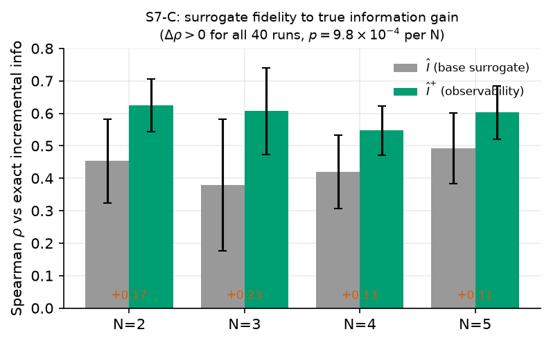
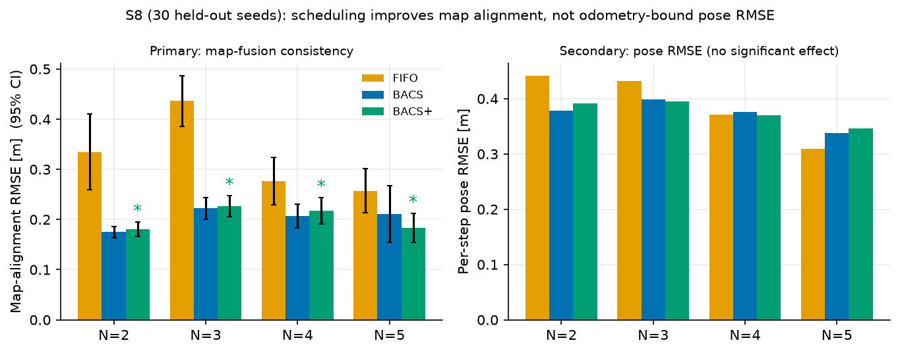
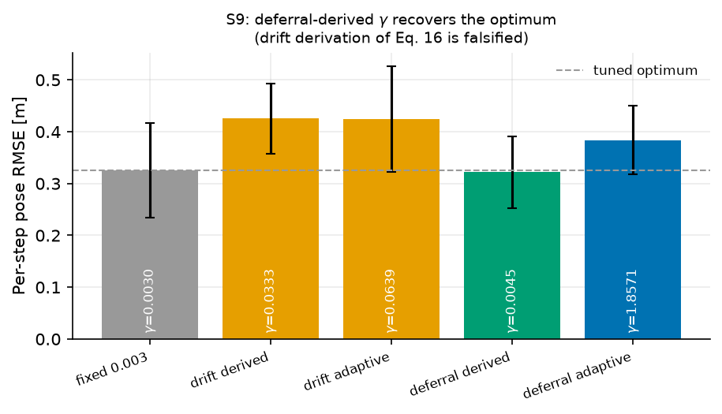
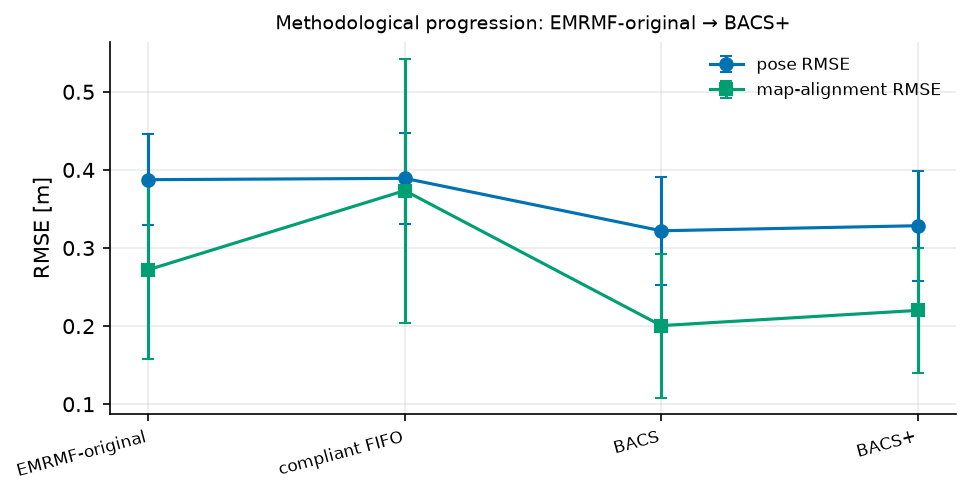

# Observability-Aware Bandwidth Scheduling for Trust-Weighted Multi-Robot Map Fusion under Duty-Cycle-Limited Wireless Links

*Author names withheld for double-anonymous review.*

## Abstract

Collaborative simultaneous localisation and mapping (SLAM) over low-power wide-area radio is commonly treated as a robustness problem: inter-robot constraints arrive late, are occasionally corrupted, and are therefore down-weighted by the fusion back-end. Under a strict duty-cycle limit, however, a more fundamental problem appears before fusion. The communication link cannot carry every candidate constraint, so map quality depends on which constraints are selected for transmission. This paper presents **Bandwidth-Aware Constraint Scheduling (BACS)**, a transmitter-side scheduling framework for trust-weighted multi-robot map fusion over duty-cycle-limited wireless links. BACS predicts the trust that a candidate constraint would receive at the fusion server, rejects candidates expected to arrive with negligible influence, and allocates the available airtime according to information density. We further introduce an **observability-aware extension** that increases priority for robot pairs whose relative transformation remains weakly constrained.

The study produces three validated findings. First, packet staleness under duty-cycle compliance is governed by airtime deferral rather than propagation delay: in the evaluated configuration, mean deferral is approximately 155 s, whereas propagation delay is only 0.05–0.2 s. A trust-decay coefficient derived from odometry drift is therefore falsified; the corrected rule, \(\gamma_{\mathrm{defer}}=\ln 2/T_{\mathrm{defer}}\approx0.0045\), recovers the empirically tuned optimum without a parameter sweep. Second, the locally computable information surrogate is validated against the exact *incremental* information gain available at scheduling time. Across 40 paired runs spanning teams of two to five robots, the observability-aware surrogate improves Spearman rank correlation in every run, with median gains of 0.10–0.23 and one-sided Wilcoxon \(p=9.8\times10^{-4}\) at each team size. Third, a 30-seed held-out evaluation shows that scheduling has no statistically significant effect on per-step pose RMSE, which is dominated by local odometry drift, but substantially improves **map-alignment RMSE**, the metric directly associated with inter-robot fusion consistency. Relative to FIFO transmission, the BACS family reduces map-alignment RMSE by approximately 21–49% for two to four robots; at five robots, the observability-aware formulation reduces alignment RMSE from 0.257 m to 0.183 m (28.7%, \(p=7\times10^{-4}\), Cliff's \(\delta=-0.53\)). These results show that bandwidth-aware scheduling improves cross-robot map consistency even when absolute trajectory RMSE remains unchanged.

**Keywords:** Multi-robot SLAM · Constraint scheduling · LoRa · Duty-cycle regulation · Information gain · Observability · Trust weighting · ROS 2 · Internet of Robotic Things

---

## 1. Introduction

Multi-robot SLAM extends the single-robot estimation problem by requiring several independently moving agents to construct a mutually consistent representation of a shared environment. Each robot can build a local map from its own odometry and exteroceptive measurements, but a globally consistent solution requires inter-robot constraints that relate poses belonging to different local graphs. Once those constraints are available, a graph-optimisation back-end can estimate a joint configuration by minimising the residuals of odometry, loop-closure, and inter-robot edges [1–4].

In practical Internet of Robotic Things (IoRT) deployments, the estimation problem is inseparable from the communication problem. Robots may operate beyond reliable Wi-Fi coverage, in large industrial facilities, agricultural environments, disaster areas, or other locations in which long-range low-power communication is attractive. LoRa-class links provide useful range and energy characteristics, but their low data rate and regulatory airtime constraints make indiscriminate exchange of mapping data infeasible. A mapping front-end can generate candidate constraints much faster than a duty-cycle-limited radio can transmit them.

Previous trust-weighted fusion approaches address a related but later decision: after a constraint reaches the server, how strongly should it influence the global graph? A typical formulation combines a geometric consistency term with temporal decay, so stale or inconsistent measurements receive a smaller information weight. This protects the optimiser from unreliable data, but it does not recover airtime already spent transmitting a constraint that will subsequently be given negligible weight. Under a severe communication budget, the earlier question is therefore more important: **which candidate deserves to be transmitted at all?**

The scale of the mismatch is substantial. In the configuration studied here, a 52-byte LoRa packet at spreading factor 7 occupies approximately 102.7 ms. At a 1% duty-cycle ceiling, a single transmitter has roughly 0.6 s of regulatory airtime in a 60 s interval, corresponding to approximately 5.8 packets per minute before any additional system-level sharing is applied. By contrast, the collaborative mapping front-end can generate candidates at a rate two orders of magnitude higher. The system therefore operates in an oversupplied regime in which transmission policy becomes part of the estimator design.

A FIFO queue is a natural implementation default, but it is poorly matched to a trust-weighted fusion back-end. FIFO selects the oldest candidate first. The oldest candidate is also the one that has accumulated the largest temporal penalty by the time it reaches the server. The communication layer can therefore spend its scarcest resource on measurements whose influence the estimator is about to suppress.

This paper introduces **Bandwidth-Aware Constraint Scheduling (BACS)** to couple the transmission decision to the downstream trust-weighted fusion objective. BACS predicts candidate age and server-side trust before transmission, applies trust as an admissibility gate, and ranks the surviving candidates according to information gain per unit airtime. The paper then develops an observability-aware form of the information surrogate that accounts for whether a robot pair is already well constrained.

An important aspect of this study is that the final formulation was shaped by falsified hypotheses rather than by hiding them. An initial derivation of the trust-decay coefficient from platform odometry drift was wrong because it used the wrong timescale. Likewise, early small-sample scalability results appeared to show a reversal in pose RMSE at larger teams, but a 30-seed held-out evaluation showed that those large swings were sampling noise and that pose RMSE was not the metric most sensitive to inter-robot scheduling. These failures led to two corrections: a deferral-based temporal calibration and a distinction between absolute trajectory error and inter-map alignment error.

### 1.1 Contributions

This work makes four main contributions.

**1. A transmitter-side trust-aware scheduling formulation.** BACS predicts the downstream trust of each candidate before spending airtime on it. Predicted trust is used as an admissibility gate, while admitted constraints are ranked by information per unit airtime. This separates *believability* from *usefulness* and avoids the structural dominance that occurs when the two are multiplied directly.

**2. A corrected temporal calibration based on scheduling deferral.** We decompose communication age and show that, under duty-cycle compliance, scheduling deferral dominates propagation delay by roughly three orders of magnitude. A drift-derived decay rule predicts \(\gamma\approx0.0333\), whereas the tuned optimum is close to 0.003. Re-anchoring the half-life to the measured deferral timescale gives \(\gamma_{\mathrm{defer}}\approx0.0045\), which recovers the tuned performance without an offline sweep.

**3. An observability-aware information surrogate validated against exact incremental information.** The original local surrogate rewards spatial novelty, weak local connectivity, and long loop span, but it does not explicitly represent whether a particular robot-pair transformation is already well constrained. We add a pairwise observability term and validate both surrogates against exact Jacobian-based incremental information gain computed from the graph state *before* each candidate would be added. The augmented surrogate improves rank correlation in every held-out run.

**4. A statistically powered end-to-end evaluation that distinguishes trajectory accuracy from fusion consistency.** Using 30 held-out seeds for teams of two to five robots, we show that per-step pose RMSE is not significantly affected by scheduling, while map-alignment RMSE is reduced substantially. This identifies map alignment, rather than absolute pose RMSE, as the primary end-to-end metric for the communication-layer contribution studied here.

The remainder of the paper reviews related work, defines the system and communication model, develops BACS and its observability-aware extension, describes the evaluation protocol, reports the validated results, discusses limitations, and concludes with the path to physical validation.

---

## 2. Related Work

### 2.1 Multi-robot SLAM architectures

Multi-robot SLAM systems are commonly organised as centralised, distributed, or hybrid architectures. Centralised approaches provide a strong global optimisation point but create bandwidth and availability bottlenecks. Distributed approaches move estimation and consensus to the robots, improving autonomy and fault tolerance at the cost of more difficult global consistency. Hybrid systems retain local autonomy while using a server or selected agents for global optimisation, providing a practical compromise for intermittently connected teams [8–11].

Robust distributed systems such as DOOR-SLAM and dense multi-robot frameworks such as Kimera-Multi demonstrate that reliable inter-robot loop closures and graph optimisation are possible even under non-ideal conditions [8,9]. Large-scale systems such as LAMP 2.0 further illustrate the importance of sparse and resilient communication in field deployments [10]. These approaches, however, do not directly solve the transmission-selection problem considered here: when only a small fraction of generated constraints can be sent, the system must decide which measurements deserve the available airtime.

### 2.2 Communication-aware collaborative estimation

Communication constraints have been addressed through descriptor sparsification, outage-tolerant buffering, compressed graph exchange, resource-aware loop-closure detection, and communication-aware motion planning. Earlier work on communication-constrained cooperative localisation demonstrated that explicit transmission decisions become unavoidable when sensing produces information much faster than the network can carry it [14–16,23]. More recent distributed loop-closure methods formulate communication as a budgeted selection problem and show that carefully chosen subsets can preserve much of the value of exhaustive exchange [14,15].

The distinction in this paper is the coupling between selection and downstream trust weighting. A transmission rule that maximises the number of delivered constraints implicitly treats every delivered edge as equally useful. In a trust-weighted back-end, that assumption is false: an edge that arrives extremely stale or geometrically implausible may receive very little weight even though it consumed the same airtime as a useful edge. BACS therefore predicts the weight before transmission and treats expected downstream influence as part of admission.

### 2.3 Information-theoretic measurement selection

Information-theoretic SLAM methods use uncertainty reduction to decide which measurements or graph elements are worth retaining. Information-based compact pose SLAM, covariance recovery methods, marginalisation, and graph sparsification provide the mathematical foundation for evaluating the expected contribution of a candidate edge [12,13,17]. For a Gaussian approximation, a candidate measurement contributes information according to a log-determinant expression involving the current covariance and the candidate information matrix.

The exact criterion is difficult to use directly at a robot in a hybrid architecture because the required joint marginal covariance belongs to the current global graph. A transmitter may possess only a local graph and the most recent fused-map feedback. BACS therefore uses a low-cost local surrogate during online scheduling. A central methodological issue is whether that surrogate actually tracks the exact scheduling-time information gain. Section 6.3 addresses this directly and avoids a common validation error: computing an edge's information from the posterior graph *after* that edge and its neighbours are already present.

### 2.4 Robust weighting and adaptive trust

Robust graph estimation reduces the influence of outliers using robust kernels, covariance scaling, switchable constraints, or related dynamic weighting mechanisms [1,2]. Trust-weighted fusion extends the same principle to communication age: a constraint can be geometrically plausible but increasingly stale as communication delay grows. The resulting temporal coefficient must therefore reflect the timescale that actually governs packet age.

In lightly loaded networks, propagation or processing delay may dominate. Under strict duty-cycle scheduling, the dominant term can instead be the time a candidate waits for a legal transmission opportunity. This distinction motivates the deferral-based calibration proposed in Section 4.4.

### 2.5 Positioning of the proposed approach

The proposed framework lies at the intersection of communication-aware estimation, information-based measurement selection, and trust-weighted pose-graph optimisation. Its defining feature is not bandwidth awareness alone, nor age-aware weighting alone, but **coupling the transmitter's scheduling decision to the trust and information value that the constraint is expected to have when fused**.

---

## 3. Problem Statement and System Model

### 3.1 Multi-robot graph model

Consider a team of \(N\) robots exploring a shared planar environment. Robot \(i\) maintains a local pose sequence

\[
\mathbf{x}_i=\{\mathbf{x}_{i,0},\mathbf{x}_{i,1},\ldots\},
\]

where \(\mathbf{x}_{i,k}\in SE(2)\). Local odometry or loop-closure measurements form intra-robot graph edges. When two robots observe overlapping parts of the environment, the front-end generates an inter-robot candidate constraint \(c\) between nodes \((i,k)\) and \((j,l)\), with measured relative transform \(\mathbf{z}_{ij}\) and information matrix \(\Omega_{ij}\).

The fusion server maintains a global factor graph and solves a weighted nonlinear least-squares problem of the form

\[
\mathbf{x}^{*}=\arg\min_{\mathbf{x}}
\sum_{(i,j)\in\mathcal{E}}
\theta_{ij}\,
\mathbf{e}_{ij}(\mathbf{x})^{T}\Omega_{ij}\mathbf{e}_{ij}(\mathbf{x}),
\tag{1}
\]

where \(\mathbf{e}_{ij}\) is the pose-graph residual and \(\theta_{ij}\in[0,1]\) is a dynamic trust weight for inter-robot measurements. Local odometry edges use unit weight.

### 3.2 Regulatory airtime and system-level allocation

The regulatory duty-cycle ceiling and the team-level channel allocation must be distinguished. For a device operating with duty-cycle limit \(\delta\) over a scheduling window of length \(W\), the regulatory airtime ceiling is

\[
B_{\mathrm{reg}}(W)=\delta W.
\tag{2}
\]

When \(N\) robots share a single logical communication resource, the system may allocate only a fraction \(\alpha_i\) of that budget to robot \(i\):

\[
B_i(W)=\alpha_i B_{\mathrm{reg}}(W),\qquad
\sum_i\alpha_i\leq1.
\tag{3}
\]

Equal sharing gives \(\alpha_i=1/N\). Equation (3) is a coordination assumption, not a redefinition of the regulatory limit.

### 3.3 LoRa time-on-air model

For spreading factor \(SF\) and bandwidth \(BW\), the symbol time is

\[
T_{\mathrm{sym}}=\frac{2^{SF}}{BW}.
\tag{4}
\]

Using the standard LoRa payload-symbol expression, the total airtime of a payload of \(PL\) bytes is

\[
T_{\mathrm{air}}(PL)
=(n_{\mathrm{pre}}+4.25)T_{\mathrm{sym}}+n_{\mathrm{pay}}T_{\mathrm{sym}}.
\tag{5}
\]

The key scheduling property is that \(T_{\mathrm{air}}\) is a step function of payload length. Candidates therefore differ not only in expected information value but also in radio cost.

At \(SF=7\), \(BW=125\) kHz, coding rate 4/5, and a 52-byte payload, the simulated packet occupies approximately 102.7 ms. With \(\delta=1\%\) and \(W=60\) s, the per-device ceiling is 0.6 s per minute, or approximately 5.8 such packets before team-level sharing.

### 3.4 Server-side trust

The server computes a geometric-temporal trust score

\[
\theta_{ij}=
\max\left(0,1-\left(\frac{\|\mathbf{e}_{ij}\|}{\tau_e}\right)^p\right)
\exp(-\gamma\Delta t_{ij}),
\tag{6}
\]

where \(\tau_e\) is the admissible residual threshold, \(p\) controls spatial suppression, \(\gamma\) is the temporal decay coefficient, and \(\Delta t_{ij}\) is the age of the constraint when it reaches the fusion server. A small floor is applied in implementation to avoid numerical elimination of an edge.

### 3.5 Scheduling problem

Let \(\mathcal{C}\) be the candidate set available to robot \(i\) during a scheduling window. Each candidate has unknown downstream value \(v(c)\) and radio cost \(T_{\mathrm{air}}(c)\). The ideal transmission decision is

\[
\max_{x_c\in\{0,1\}}
\sum_{c\in\mathcal{C}}x_c v(c)
\quad\text{s.t.}\quad
\sum_{c\in\mathcal{C}}x_cT_{\mathrm{air}}(c)\leq B_i(W).
\tag{7}
\]

The computational structure is a zero-one knapsack problem. The harder issue is that \(v(c)\) is not directly observable at the transmitter. BACS therefore decomposes candidate value into two questions: **will the constraint still be trusted when it arrives?** and **if trusted, how informative will it be?**

---

## 4. Observability-Aware Bandwidth-Aware Constraint Scheduling

### 4.1 Predicting packet age

The age of a candidate is decomposed into cross-window deferral, within-window queueing, its own airtime, and expected retransmission cost:

\[
\widehat{\Delta t}_c=
 k_cW+
\sum_{q\in\mathcal{Q}_c}T_{\mathrm{air}}(q)+
T_{\mathrm{air}}(c)+
\widehat{T}_{\mathrm{retry}}(c).
\tag{8}
\]

Here, \(k_c\) is the expected number of complete windows the candidate must wait, and \(\mathcal{Q}_c\) is the set of packets scheduled ahead of it in the current window. With estimated packet-loss probability \(\hat p_L\) and acknowledgement timeout \(T_{\mathrm{to}}\), the expected retransmission contribution is approximated by

\[
\widehat{T}_{\mathrm{retry}}(c)=
\frac{\hat p_L}{1-\hat p_L}
\left(T_{\mathrm{air}}(c)+T_{\mathrm{to}}\right).
\tag{9}
\]

The cross-window deferral term is essential in the evaluated regime. Omitting it calibrates trust to a sub-second timescale even though candidates can remain queued for minutes.

### 4.2 Predicting trust before transmission

The server's true residual requires the current fused estimates of both endpoint poses. The transmitting robot substitutes the most recently received fused-map poses, producing provisional residual

\[
\widetilde{\mathbf{e}}_{ij}
=
\mathbf{z}_{ij}-h(\hat{\mathbf{x}}^{g}_{i},\hat{\mathbf{x}}^{g}_{j}).
\tag{10}
\]

The predicted trust is

\[
\hat\theta_{ij}=
\max\left(0,1-\left(\frac{\|\widetilde{\mathbf{e}}_{ij}\|}{\tau_e}\right)^p\right)
\exp(-\gamma\widehat{\Delta t}_{ij}).
\tag{11}
\]

Using raw local odometry for this residual is undesirable because accumulated ego-drift can dominate the quantity being interpreted as measurement quality. The fused-map feedback path therefore remains part of the scheduling architecture. When the fused map becomes stale, confidence in the geometric prediction is reduced and the scheduler increasingly falls back toward information-driven selection.

### 4.3 Exact incremental information and the local surrogate

For a candidate with Jacobian \(J_c\), information matrix \(\Omega_c\), and scheduling-time joint marginal covariance \(\Sigma_{ij,t}\), the exact incremental information gain is

\[
I_c=
\frac{1}{2}
\log\det\left(
I+\Omega_cJ_c\Sigma_{ij,t}J_c^{T}
\right).
\tag{12}
\]

This quantity is available for offline validation from the global graph but is not assumed to be available at the transmitter. The local scheduler therefore uses the surrogate

\[
\hat I_c=
 w_{\nu}\bar\nu_c+
 w_d(1-\bar d_c)+
 w_l\bar l_c,
\qquad
w_{\nu}+w_d+w_l=1,
\tag{13}
\]

where \(\bar\nu_c\) is coverage novelty, \(\bar d_c\) is the normalised degree of the local graph node, and \(\bar l_c\) is the normalised loop span.

Coverage novelty encourages spatial diversity, but it does not explicitly represent whether the relative transformation of robot pair \((i,j)\) is already well constrained. To address that gap, the observability-aware extension adds

\[
O_{ij}=\exp\left(-\frac{n_{ij}}{n_{\mathrm{ref}}}\right),
\tag{14}
\]

where \(n_{ij}\) is the number of already delivered inter-robot constraints for that pair. The augmented surrogate is

\[
\hat I_c^{+}=\hat I_c+w_oO_{ij}.
\tag{15}
\]

The implementation uses the S7-C-validated setting \(w_o=0.30\), \(n_{\mathrm{ref}}=6\). A stronger screening setting, \(w_o=0.60\), \(n_{\mathrm{ref}}=5\), produced statistically indistinguishable end-to-end results and is therefore not used as the principal configuration.

### 4.4 Why trust is gated rather than multiplied

A natural first formulation is

\[
u_c=\frac{\hat\theta_c\hat I_c}{T_{\mathrm{air}}(c)}.
\tag{16}
\]

In practice, the multiplicative form is poorly conditioned for ranking because \(\hat\theta\) can span orders of magnitude under exponential temporal decay, whereas \(\hat I\) is bounded to a much narrower interval. The ordering therefore becomes effectively trust-only.

BACS instead uses trust as an admissibility condition and ranks the survivors by information density:

\[
S^{*}=\arg\max_{S}
\sum_{c\in S}
\frac{\hat I_c^{(+)}}{T_{\mathrm{air}}(c)}
\tag{17}
\]

subject to

\[
\hat\theta_c\geq\theta_{\mathrm{gate}},
\qquad
\sum_{c\in S}T_{\mathrm{air}}(c)\leq B_i(W).
\tag{18}
\]

A deferred candidate receives an ageing multiplier so that persistent low-ranked regions are not starved indefinitely. Candidates whose predicted trust falls below the gate are expired rather than retained forever.

### 4.5 Greedy solution and computational cost

The selection is solved by sorting candidates according to information density and admitting candidates greedily until the budget is exhausted, with a single-best-candidate guard. This is the standard factor-of-two greedy approximation for knapsack. The complexity is \(O(n\log n)\) per scheduling window. In the evaluated team sizes, scheduler runtime is negligible relative to the 60 s scheduling interval.

### 4.6 Correcting the temporal decay coefficient

An initial physical derivation anchored temporal decay to accumulated odometry error. For drift rate \(\sigma_d\), mean speed \(\bar v\), and residual threshold \(\tau_e\), it gives

\[
\gamma_{\mathrm{drift}}
=
\frac{\ln2\,\sigma_d\bar v}{\tau_e}.
\tag{19}
\]

For the evaluated configuration this yields approximately 0.0333 s\(^{-1}\). The experiments falsify this value because the dominant ageing process is not motion during sub-second propagation but multi-window scheduling deferral. We therefore propose

\[
\gamma_{\mathrm{defer}}
=
\frac{\ln2}{T_{\mathrm{defer}}},
\tag{20}
\]

where \(T_{\mathrm{defer}}\) is a measured central tendency of the deferral distribution. With \(T_{\mathrm{defer}}\approx155\) s, Eq. (20) gives \(\gamma\approx0.0045\) s\(^{-1}\).

---

## 5. Experimental Design

### 5.1 Simulation platform

The evaluation uses the canonical full simulation pipeline in the repository: ground-truth world generation, odometry drift, candidate generation, LoRa airtime and loss, trust prediction, information/observability scoring, scheduling, and a weighted SE(2) Gauss–Newton pose-graph back-end. The standalone communication-only reference model is not used to generate any reported RMSE result.

Robots traverse overlapping partitions of a 14.0 m × 10.5 m environment in a boustrophedon pattern at 0.30 m/s. Pose nodes are generated every 2 s. Odometry drift is distance-dependent; candidate inter-robot constraints are generated when robots occupy nearby ground-truth positions, with measurement noise and a configurable outlier population. The radio model uses 868 MHz LoRa, SF7, 125 kHz bandwidth, coding rate 4/5, and a 1% duty-cycle ceiling. Unless otherwise stated, scheduling windows are 60 s.

**Table 1. Principal simulation configuration.**

| Parameter | Value |
|---|---:|
| Environment | 14.0 × 10.5 m |
| Robot speed | 0.30 m/s |
| Pose interval | 2.0 s |
| Observation radius | 3.0 m |
| Outlier rate | 12% |
| Admissible residual \(\tau_e\) | 0.5 m |
| Shaping exponent \(p\) | 3 |
| LoRa carrier | 868 MHz |
| Spreading factor | SF7 |
| Bandwidth | 125 kHz |
| Coding rate | 4/5 |
| Duty-cycle ceiling | 1% |
| Scheduling window \(W\) | 60 s |
| Principal BACS+ setting | \(w_o=0.30\), \(n_{\mathrm{ref}}=6\) |

### 5.2 Metrics

Two end-to-end error metrics are reported, but they serve different purposes.

**Map-alignment RMSE** is the **primary S8 metric**. It measures disagreement between robot maps over ground-truth co-location pairs in overlapping regions. This directly reflects the purpose of inter-robot constraints: to determine relative transforms and align separately drifting local maps.

**Per-step pose RMSE** is the secondary metric. It measures each robot's trajectory error relative to ground truth after anchoring the local gauge. Because a large fraction of this error originates in each robot's local odometry, it need not change when only the scheduling of inter-robot constraints changes.

Additional metrics include trust yield, number of delivered constraints, airtime utilisation, scheduling overhead, delay-prediction bias, and information-surrogate rank correlation.

### 5.3 Hypotheses and validation questions

The study retains the original hypotheses rather than rewriting them after the results.

- **H1:** the drift-derived Eq. (19) predicts the empirically useful temporal decay coefficient. **Falsified.**
- **H2:** using predicted trust as a gate and ranking admitted constraints by information density is preferable to the multiplicative trust × information formulation. **Supported by the policy ablation.**
- **H3:** the scheduling advantage, measured initially using pose RMSE, increases monotonically with team size. **Not supported.** The larger apparent reversals in early few-seed runs disappear under the 30-seed evaluation; pose RMSE is largely policy-insensitive.
- **H3b:** adding pairwise observability improves the transmitter-side surrogate's fidelity to exact scheduling-time incremental information. **Supported by S7-C.**

### 5.4 Statistical protocol

The decisive S8 comparison uses **30 held-out seeds (10–39)** that were disjoint from the earlier screening runs. Policies are compared on identical generated worlds, enabling paired analysis. Wilcoxon signed-rank tests are used because the paired errors are not assumed Gaussian. Cliff's \(\delta\) is reported as a non-parametric effect size for the primary map-alignment comparisons.

S7-C uses 10 seeds per team size. Correlations are calculated per seed rather than by pooling all candidates into one large sample, preventing a single high-volume run from dominating the result. The difference \(\Delta\rho=\rho(\hat I^{+},I)-\rho(\hat I,I)\) is then tested across seeds using a one-sided paired Wilcoxon test.

---

## 6. Results

### 6.1 Where packet staleness actually comes from

Under the regulatory duty-cycle regime, the dominant component of packet age is not propagation. In the evaluated configuration, additional channel delay lies in the range 0.05–0.2 s and packet airtime is approximately 0.103 s, whereas scheduling deferral is on the order of **155 s**. The timescales therefore differ by roughly three orders of magnitude.

This observation changes the interpretation of temporal trust. The age term remains important, but it must be calibrated to the scheduling queue rather than to propagation latency alone. It also explains why adding 0.2 s of propagation delay produced negligible changes in the earlier channel robustness runs compared with seed-to-seed variation.

### 6.2 S9: the drift-derived decay is falsified and the deferral rule recovers the optimum

**Table 2. Temporal decay rules (5 seeds, two robots).**

| Rule | \(\gamma\) [s\(^{-1}\)] | Pose RMSE [m] |
|---|---:|---:|
| Fixed tuned optimum | 0.0030 | 0.325 |
| Drift-derived, Eq. (19) | 0.0333 | 0.425 |
| Drift-adaptive | 0.064 | 0.424 |
| **Deferral-derived, Eq. (20)** | **0.0045** | **0.322** |
| Deferral-adaptive | 1.86 | 0.384 |

The drift-derived coefficient overestimates the useful decay rate by approximately one order of magnitude and raises RMSE from approximately 0.325 m to 0.425 m. By contrast, the deferral-derived rule gives 0.322 m, effectively matching the tuned 0.003 configuration without a sweep.

The tested online deferral-adaptive rule is less successful because it updates from the delays of packets that were actually delivered. Those packets are systematically fresher than the full backlog, so the estimate does not represent queue-wide deferral. This negative result is retained because it identifies the quantity a future online estimator must track: the deferral distribution of the candidate population, not only successful transmissions.

### 6.3 S7-C: validation against exact scheduling-time incremental information

A candidate scheduler needs to predict **how much information the candidate would add now**. Computing information from the fully converged posterior graph is therefore methodologically wrong: the graph already contains the candidate edge and neighbouring edges, so well-solved regions can appear to have low information precisely because the measurements have already performed their corrective work.

S7-C instead evaluates every presented candidate against the graph state immediately before that candidate's scheduling window. For candidate \(c\), exact information is computed using Eq. (12), the current joint covariance, and the actual SE(2) relative-pose Jacobian. All presented candidates are included, not only delivered ones, avoiding policy-induced selection bias.

**Table 3. Per-seed incremental-information fidelity (10 seeds per team size).**

| Robots \(N\) | \(\rho(\hat I, I)\) | \(\rho(\hat I^{+}, I)\) | Median \(\Delta\rho\) | Runs with \(\Delta\rho>0\) | One-sided \(p\) |
|---:|---:|---:|---:|---:|---:|
| 2 | 0.45 ± 0.13 | 0.62 ± 0.08 | +0.17 | 10/10 | 9.8×10\(^{-4}\) |
| 3 | 0.38 ± 0.20 | 0.61 ± 0.13 | +0.23 | 10/10 | 9.8×10\(^{-4}\) |
| 4 | 0.42 ± 0.11 | 0.55 ± 0.08 | +0.13 | 10/10 | 9.8×10\(^{-4}\) |
| 5 | 0.49 ± 0.11 | 0.60 ± 0.08 | +0.11 | 10/10 | 9.8×10\(^{-4}\) |

The base surrogate is positively correlated with exact incremental information at every team size. More importantly, the observability-aware surrogate improves the correlation in **all 40 paired runs**. The effect is therefore not produced by pooling a large candidate population or by one favourable random seed.

For transparency, the repository also preserves the earlier posterior-based diagnostic. It gives strongly negative correlations (approximately −0.4 to −0.6), demonstrating how using the wrong temporal reference can invert the apparent result. The posterior correlation is retained only to document the methodological artifact and is not used as evidence about BACS.

### 6.4 S8: 30-seed end-to-end map-fusion evaluation

The decisive end-to-end experiment compares FIFO, gated BACS, and the observability-aware formulation on held-out seeds 10–39 for teams of two to five robots. The deferral-derived decay coefficient is used throughout. Map-alignment RMSE is the primary metric.

**Table 4. Map-alignment RMSE, primary S8 metric.**

| \(N\) | FIFO [m] | BACS [m] | Observability-aware BACS [m] | BACS vs FIFO | Obs.-aware BACS vs FIFO |
|---:|---:|---:|---:|---|---|
| 2 | 0.334 | 0.175 | 0.180 | 47.6% lower, \(p=4\times10^{-9}\), \(\delta=-0.82\) | 46.0% lower, \(p=5\times10^{-8}\), \(\delta=-0.79\) |
| 3 | 0.436 | 0.222 | 0.227 | 49.1% lower, \(p=4\times10^{-9}\), \(\delta=-0.92\) | 48.1% lower, \(p=2\times10^{-9}\), \(\delta=-0.90\) |
| 4 | 0.276 | 0.207 | 0.217 | 25.2% lower, \(p=1\times10^{-3}\), \(\delta=-0.42\) | 21.3% lower, \(p=0.011\), \(\delta=-0.32\) |
| 5 | 0.257 | 0.211 | **0.183** | 17.9% lower, \(p=0.067\), n.s. | **28.7% lower, \(p=7\times10^{-4}\), \(\delta=-0.53\)** |

For two and three robots, both BACS formulations almost halve alignment error and yield large effect sizes. At four robots, both remain significantly better than FIFO, although the effect size narrows. At five robots, plain BACS is only marginal relative to FIFO, whereas the observability-aware formulation retains a statistically significant 28.7% reduction.

The direct pairwise difference between plain BACS and observability-aware BACS is **not statistically significant** on either end-to-end metric at the tested seed count. We therefore do not claim that the observability term universally outperforms the base scheduler in RMSE. Its stronger support comes from two converging observations: it improves fidelity to exact incremental information in every S7-C run, and it is the formulation that retains a significant alignment advantage over FIFO at \(N=5\).

### 6.5 Pose RMSE is not the metric that separates the schedulers

**Table 5. Per-step pose RMSE, secondary S8 metric.**

| \(N\) | FIFO [m] | BACS [m] | Observability-aware BACS [m] |
|---:|---:|---:|---:|
| 2 | 0.442 | 0.378 | 0.391 |
| 3 | 0.432 | 0.399 | 0.395 |
| 4 | 0.372 | 0.376 | 0.370 |
| 5 | 0.310 | 0.337 | 0.346 |

No policy differs significantly from another on pose RMSE at any team size (all paired Wilcoxon \(p>0.11\)). The large positive and negative percentage swings seen in the earlier three- to six-seed experiments therefore do not survive the higher-powered evaluation.

This is not evidence that scheduling is ineffective. Rather, the two metrics measure different parts of the estimation problem. The scheduler controls **which inter-robot constraints connect local graphs**. It can therefore strongly affect the relative alignment of independently drifting maps. It cannot directly remove the local odometry error accumulated inside each robot's trajectory. Map-alignment RMSE is consequently the more sensitive end-to-end measure for the contribution studied here.

### 6.6 Overall methodological progression

The experiments support the following progression:

1. **Receiver-side trust weighting** protects the global optimiser after a constraint arrives.
2. **BACS** moves the decision upstream and prevents scarce airtime from being spent on candidates predicted to have negligible downstream influence.
3. **Deferral-aware decay calibration** places temporal trust on the correct queueing timescale.
4. **Observability-aware information ranking** improves the transmitter-side approximation to exact graph information and preserves statistically significant map-alignment improvement in the largest evaluated team.

The resulting conclusion is more specific than an undifferentiated claim of “better SLAM”: bandwidth-aware scheduling improves **cross-robot map consistency** under the evaluated communication constraint, while absolute pose RMSE remains dominated by local estimation error.

### 6.7 Figures

---

## 7. Discussion

### 7.1 Scheduling improves map alignment rather than absolute trajectory accuracy

The strongest end-to-end result is the separation between map-alignment RMSE and pose RMSE. This distinction clarifies what an inter-robot transmission scheduler can and cannot change. Inter-robot constraints chiefly determine the relative placement of independently constructed local graphs. They are therefore expected to affect map alignment strongly. Local wheel odometry and onboard sensing dominate the internal shape of each robot's own trajectory, so changing which cross-robot edges are sent does not necessarily produce a measurable change in per-step absolute pose RMSE.

This finding also explains why the original small-sample scalability story was unstable. With only a few seeds, pose RMSE produced apparent ±20–30% policy differences. Under 30 held-out seeds, none of those differences remains significant. The more directly coupled alignment metric, by contrast, exhibits strong and repeatable improvements.

### 7.2 What the observability term contributes

The pairwise term should not be described as a universally superior RMSE policy. The direct BACS-vs-observability-aware comparison is not significant at 30 seeds. Its validated contribution is narrower and more defensible: it improves the fidelity of the local information approximation in every S7-C run and maintains a significant alignment advantage over FIFO at the largest evaluated team size.

The term is intentionally simple. Counting previously delivered constraints is only a proxy for pairwise determinacy. A future version could replace Eq. (14) with a covariance-, determinant-, or condition-number-based estimate derived from periodically broadcast graph summaries. Such a method would more directly represent observability but would increase computation and communication requirements.

### 7.3 Why the corrected S7-C matters

The surrogate-validation correction is a methodological result in its own right. Information gain is an incremental quantity. Evaluating a candidate against a posterior that already contains that edge can reverse the ranking because a valuable edge makes its region well constrained. For scheduling and measurement-selection studies, validation must use the graph state before candidate insertion. The repository retains both calculations to make this distinction reproducible.

### 7.4 Temporal weighting should follow the queueing timescale

The decay-calibration result also has broader implications. A communication-aware estimator should calibrate temporal trust to the delay process that dominates in its actual operating regime. Under abundant bandwidth, propagation and processing may matter. Under duty-cycle-limited operation, legal transmission opportunities and backlog dominate. A single fixed \(\gamma\) cannot be expected to transfer across radically different oversupply ratios.

The deferral-derived rule is attractive because it replaces a hand-tuned coefficient with a measurable system quantity. However, the unsuccessful online adaptive variant shows that care is required: observing only delivered packets produces a biased view of the backlog. A deployment-quality adaptive rule should estimate queue-wide candidate deferral, for example from censored queue statistics or periodic backlog summaries.

### 7.5 Communication efficiency versus raw send-all performance

No compliant scheduler can completely reproduce the performance of an unconstrained send-all system when the radio budget excludes most candidate constraints. The purpose of BACS is therefore not to make bandwidth irrelevant, but to spend the available airtime on constraints with greater expected downstream value. The remaining gap to non-compliant exhaustive delivery quantifies the value of additional bandwidth or a higher-capacity communication layer.

---

## 8. Threats to Validity and Limitations

**Simulation-only end-to-end validation.** The principal limitation is that the reported map-alignment and pose results are generated in simulation. The simulator reproduces the sensing, radio, trust, and graph-optimisation pipeline, but absolute values should not be interpreted as hardware measurements. Physical validation is required before deployment claims are made.

**Candidate-generation model.** The oversupply ratio and therefore the deferral distribution depend on the front-end candidate rate. A different detector, environment, overlap pattern, or radio configuration will produce a different \(T_{\mathrm{defer}}\). The paper therefore does not recommend adopting \(\gamma=0.0045\) universally; deployments should estimate their own deferral distribution and apply Eq. (20).

**Observability proxy.** The pair-count term in Eq. (14) is a heuristic surrogate for determinacy, not an exact observability measure. S7-C shows that it improves correlation with exact incremental information, but more principled graph-based summaries may perform better.

**Parameter screening.** Observability parameters were explored during method development on the same simulator family. To limit optimistic reporting, the final S8 evaluation uses held-out seeds 10–39, and the selected 0.30/6 configuration is supported independently by S7-C. Nevertheless, transfer to unseen physical environments remains untested.

**Shared-channel abstraction.** The simulation separates the per-device regulatory duty-cycle ceiling from the team-level equal-share allocation. Real deployments may use carrier sensing, multiple sub-bands, channel hopping, acknowledgements, gateway scheduling, or other mechanisms that change the usable share.

**Adversarial behaviour.** The present paper assumes cooperative robots. A malicious or faulty robot could attempt to inflate declared trust, novelty, or observability and capture a disproportionate fraction of shared airtime. Agent-level reputation and authenticated scheduling metadata are natural extensions but are outside the scope of this work.

---

## 9. Conclusion and Future Work

This paper addressed a communication-layer limitation of trust-weighted collaborative SLAM: when a low-power radio cannot transmit every inter-robot constraint, weighting received measurements is not enough. The system must decide which candidates deserve airtime before transmission.

BACS couples transmitter-side admission to the downstream trust-weighted fusion objective. Predicted trust removes candidates expected to arrive with negligible influence, while information density allocates the remaining budget. The experiments show that temporal trust must be calibrated to scheduling deferral rather than propagation delay in the evaluated duty-cycle regime. The deferral-derived rule \(\gamma=\ln2/T_{\mathrm{defer}}\) matches the empirically tuned solution without a sweep.

The information component is also validated directly. When exact information is evaluated correctly as incremental gain against the pre-candidate graph, the local surrogate is positively correlated with the true quantity, and the observability-aware extension improves that correlation in all 40 paired runs. The end-to-end effect appears most clearly in map alignment: on 30 held-out seeds, BACS reduces inter-map inconsistency substantially for two to four robots, and the observability-aware formulation retains a 28.7% significant reduction at five robots. Per-step pose RMSE does not change significantly, showing that the communication policy mainly improves cross-robot consistency rather than local odometry-dominated trajectory error.

The immediate next step is physical validation using the existing ROS 2 trust-weighted multi-robot platform and a real LoRa link, with motion-capture ground truth where available. Beyond that, future work should replace the pair-count observability proxy with a graph-derived uncertainty summary, develop an unbiased online estimator of queue-wide deferral, evaluate heterogeneous sensing and radio configurations, and extend the scheduler with agent-level reputation for faulty or adversarial teams.

---

## Reproducibility

All numerical results are backed by frozen CSV files and executable experiment runners in the repository.

| Result | Implementation / script | Frozen output |
|---|---|---|
| Trust-decay rules | `experiments.s9_deferral_gamma` | `paper_results/s9_deferral_gamma.csv` |
| Correct incremental surrogate validation | `experiments.s7c_incremental_validation` / paired runner | `paper_results/s7c_incremental_validation.csv`, `paper_results/s7c_paired.csv` |
| Prior/posterior diagnostic | `experiments.s7_surrogate_validation` | `paper_results/s7_surrogate_validation.csv` |
| 30-seed held-out S8 | `scripts/run_s8_30seed.py` | `paper_results/s8_30seed_raw.csv`, `s8_30seed_summary.csv`, `s8_30seed_tests.csv` |
| Figures | `scripts/make_figures.py` | `paper_figures/*.png` |

The canonical path for reported pose and alignment metrics is `world → lora → trust → infogain/observability → scheduler → posegraph → simulator`. The standalone communication-layer reference module is not used to produce the manuscript RMSE values.

---

## References

1. Grisetti, G., Kümmerle, R., Stachniss, C., Burgard, W.: A tutorial on graph-based SLAM. *IEEE Intelligent Transportation Systems Magazine* 2(4), 31–43 (2010).
2. Agarwal, P., Tipaldi, G.D., Spinello, L., Stachniss, C., Burgard, W.: Robust map optimization using dynamic covariance scaling. In: *Proc. IEEE International Conference on Robotics and Automation (ICRA)*, pp. 62–69 (2013).
3. Kümmerle, R., Grisetti, G., Strasdat, H., Konolige, K., Burgard, W.: g2o: A general framework for graph optimization. In: *Proc. IEEE ICRA*, pp. 3607–3613 (2011).
4. Dellaert, F.: Factor graphs and GTSAM: A hands-on introduction. *Foundations and Trends in Robotics* 1(1–2), 1–139 (2012).
5. Labbé, M., Michaud, F.: RTAB-Map as an open-source LiDAR and visual SLAM library for large-scale and long-term online operation. *Journal of Field Robotics* 36(2), 416–446 (2019).
6. Campos, C., Elvira, R., Rodríguez, J.J.G., Montiel, J.M.M., Tardós, J.D.: ORB-SLAM3: An accurate open-source library for visual, visual-inertial, and multi-map SLAM. *IEEE Transactions on Robotics* 37(6), 1874–1890 (2021).
7. Zhang, J., Singh, S.: LOAM: Lidar odometry and mapping in real-time. In: *Robotics: Science and Systems* (2014).
8. Lajoie, P.-Y., Ramtoula, B., Chang, Y., Carlone, L., Beltrame, G.: DOOR-SLAM: Distributed, online, and outlier resilient SLAM for robotic teams. *IEEE Robotics and Automation Letters* 5(2), 1656–1663 (2020).
9. Rosinol, A., Abate, M., Chang, Y., Carlone, L.: Kimera-Multi: Robust distributed dense metric-semantic SLAM for multi-robot systems. *IEEE Transactions on Robotics* 38(2), 774–795 (2022).
10. Ebadi, K., et al.: LAMP 2.0: Robust multi-robot SLAM for large-scale subterranean environments. *IEEE Robotics and Automation Letters* 7(2), 2135–2142 (2022).
11. Cunningham, A., Indelman, V., Dellaert, F.: DDF-SAM 2.0: Consistent distributed smoothing and mapping. *IEEE Transactions on Robotics* 29(4), 786–801 (2013).
12. Ila, V., Porta, J.M., Andrade-Cetto, J.: Information-based compact pose SLAM. *IEEE Transactions on Robotics* 26(1), 78–93 (2010).
13. Kaess, M., Dellaert, F.: Covariance recovery from a square root information matrix for data association. *Robotics and Autonomous Systems* 57(12), 1198–1210 (2009).
14. Giamou, M., Khosoussi, K., How, J.P.: Talk resource-efficiently to me: Optimal communication planning for distributed loop closure detection. In: *Proc. IEEE ICRA* (2018).
15. Tian, Y., Khosoussi, K., How, J.P.: Resource-aware algorithms for distributed loop closure detection with provable performance guarantees. *International Journal of Robotics Research* (2021).
16. Paull, L., Huang, G., Seto, M., Leonard, J.J.: Communication-constrained multi-AUV cooperative SLAM. In: *Proc. IEEE ICRA* (2015).
17. Carlevaris-Bianco, N., Eustice, R.M.: Generic factor-based node marginalization and edge sparsification for pose-graph SLAM. In: *Proc. IEEE ICRA* (2013).
18. Semtech Corporation: *LoRa Modulation Basics*, Application Note AN1200.22.
19. ETSI: *Short Range Devices operating in the frequency range 25 MHz to 1000 MHz*, EN 300 220-2.
20. Maruyama, Y., Kato, S., Azumi, T.: Exploring the performance of ROS 2. *IEEE Embedded Systems Letters* 8(3), 55–58 (2016).
21. Macenski, S., et al.: From the ROS navigation stack to Nav2. *Science Robotics* 7(66) (2022).
22. Al-Surmi, A., Othman, M., Othman, M.F.I.: Internet of Robotic Things (IoRT): Recent advances, applications, and challenges. *Sensors* 22(9), 3325 (2022).
23. Kantaros, Y., Zavlanos, M.M.: Distributed communication-aware motion planning and task allocation for multi-robot systems. *IEEE Transactions on Robotics* 36(4), 1131–1148 (2020).
24. Carlone, L., Censi, A., Dellaert, F.: Distributed pose graph optimization for multi-robot mapping. *IEEE Transactions on Robotics* 31(5), 1200–1213 (2015).
25. Rosen, D.M., Carlone, L., Bandeira, A.S., Leonard, J.J.: SE-Sync: A certifiably correct algorithm for synchronization over the special Euclidean group. *International Journal of Robotics Research* 38(2–3), 95–125 (2019).
26. Rosinol, A., Ebadi, K., Carlone, L.: Research challenges in multi-robot SLAM: Scalability, robustness, and communication constraints. *IEEE Robotics & Automation Magazine* 30(4), 82–95 (2023).

---

## Declarations

**Funding.** The authors received no specific funding for this work.

**Conflict of interest.** The authors declare no competing interests.

**Ethics approval.** Not applicable; no human participants or animal subjects were involved.

**Data and code availability.** The simulation code, experiment runners, frozen result files, and figure-generation scripts are available in the project repository. The public repository link will be inserted in the manuscript after completion of double-anonymous review, in accordance with the target venue's review policy.

**Use of generative AI.** To be completed by the authors in accordance with the target publisher's current policy, accurately describing any generative-AI assistance used for language editing, drafting, analysis, or code generation. Generative AI tools are not authors and do not satisfy authorship criteria.
